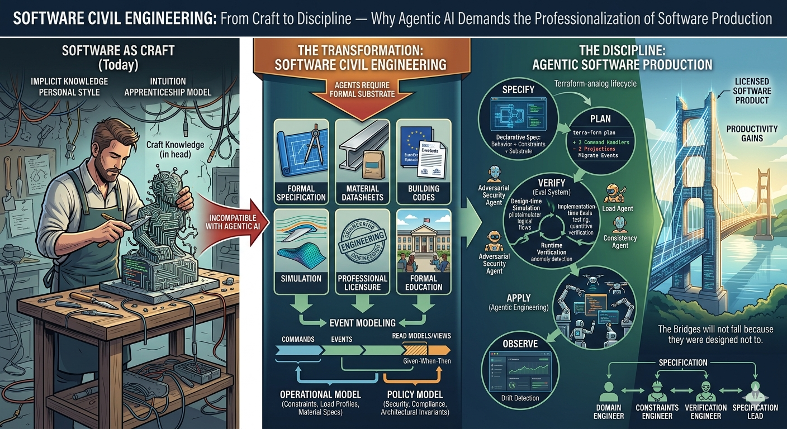

# Daily D4 Digest

A daily intelligence brief on **agentic engineering**, analyzed through two lenses:

## The D1-D4 Framework

*Four dimensions that define how we build, what we ship, and how we scale in the age of agentic product engineering.*

|             | Internal                      | External                     |
| ----------- | ----------------------------- | ---------------------------- |
| Building    | **D1: Agentic Engineering**   | **D2: AI in the Product**    |
| Scaling     | **D4: Performance & Cost**    | **D3: Build for Agents**     |

> [!info]- D1 — Agentic Engineering · *how we build*
> Engineers evolve from writing code to orchestrating AI agents in an AI-native architecture and pipeline.

> [!info]- D2 — AI in the Product · *what we build*
> Static forms give way to conversational interfaces, generated UIs, and embedded agents.

> [!info]- D3 — Build for Agents · *who consumes*
> Products serve AI agents as first-class consumers via interoperability protocols.

> [!info]- D4 — Performance & Cost · *how we sustain*
> Agent traffic amplifies load 10–100×. Right-sized infra delivers 10× scale at a fraction of cost.

## [Software Civil Engineering](https://martinrl.github.io/chronograph/software-civil-engineering)

The thesis that agentic AI is the forcing function for software's professionalization — from craft to engineering discipline.

---

## Recent Briefs

Browse the [[briefs/]] folder for daily digests.
